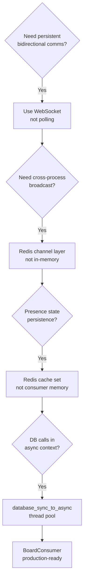
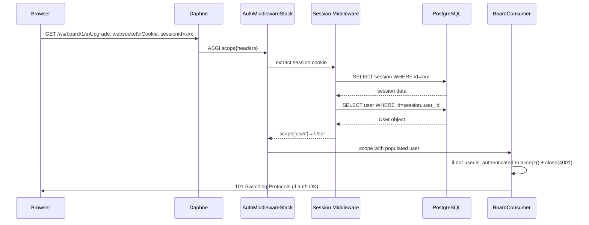
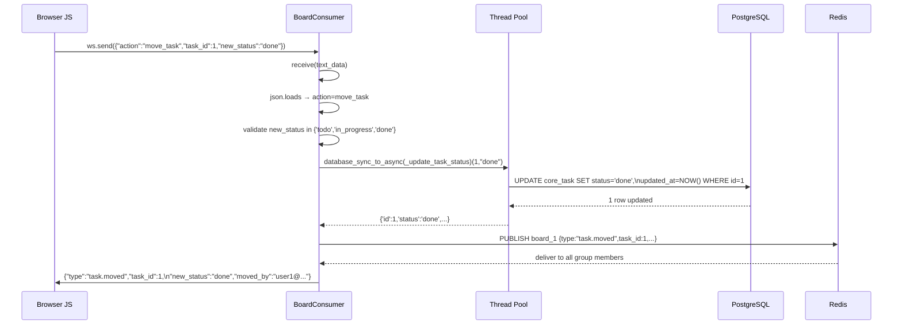
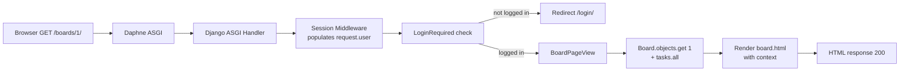
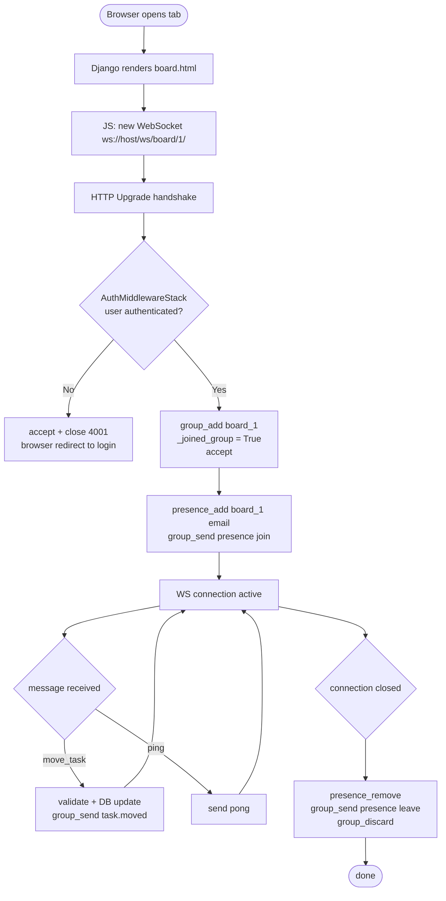
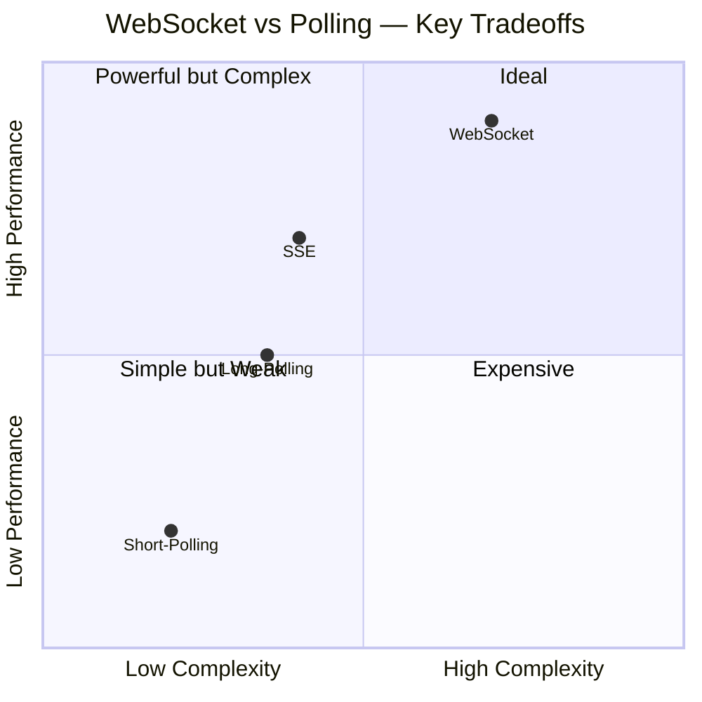

# 📘 BoardPulse — Project Documentation

> Complete technical documentation covering every aspect of the BoardPulse real-time collaborative task board, from problem statement through implementation details to verification strategy.

---

## Table of Contents

1. [Project Overview](#1-project-overview)
2. [Problem Statement](#2-problem-statement)
3. [Solution Approach](#3-solution-approach)
4. [Tech Stack & Rationale](#4-tech-stack--rationale)
5. [Key Modules & Responsibilities](#5-key-modules--responsibilities)
6. [Implementation Details](#6-implementation-details)
7. [Data Flow Documentation](#7-data-flow-documentation)
8. [API Specification](#8-api-specification)
9. [WebSocket Protocol Specification](#9-websocket-protocol-specification)
10. [Testing & Verification](#10-testing--verification)
11. [Benchmarking Analysis](#11-benchmarking-analysis)
12. [Advantages & Limitations](#12-advantages--limitations)
13. [Known Issues & Edge Cases](#13-known-issues--edge-cases)
14. [Future Enhancements](#14-future-enhancements)

---

## 1. Project Overview

**BoardPulse** is a real-time, collaborative Kanban task board that enables multiple users to manage tasks simultaneously with instant synchronization across all connected browsers. It is the canonical demonstration of transitioning a Django application from the traditional synchronous WSGI paradigm to the modern asynchronous ASGI paradigm using Django Channels.

### Objectives

- Demonstrate the ASGI/Channels consumer lifecycle in production-quality code
- Implement safe asynchronous database operations using `database_sync_to_async`
- Build scalable multi-client broadcasting via Redis channel layers
- Track live user presence across distributed consumer instances
- Containerize the entire stack for reproducible deployment

### Scope

| In Scope | Out of Scope |
|---|---|
| Real-time task status updates | Task assignment via UI |
| Live presence (join/leave) | Board permissions/roles |
| WebSocket authentication (4001) | OAuth / SSO |
| REST API for boards & tasks | File attachments |
| Drag-and-drop Kanban UI | Rich text descriptions |
| Docker Compose orchestration | Kubernetes deployment |
| Load testing benchmark | Frontend unit tests |

---

## 2. Problem Statement

Traditional Django applications use WSGI — a synchronous, stateless protocol where each HTTP request opens a connection, receives a response, and the connection closes. This model is efficient for conventional CRUD applications but fundamentally unsuitable for collaborative tools that require:

- **Persistent connections** — the server must push data to clients without a request trigger
- **Multi-client broadcast** — a change by one user must reach all other connected users instantly
- **Low latency** — users expect < 100ms propagation for collaborative interactions
- **Stateful sessions** — the server must know which clients are connected to which board

Traditional workarounds (polling, long-polling, SSE) each carry significant drawbacks:

| Approach | Latency | Server Load | Bidirectional | Scalability |
|---|---|---|---|---|
| Polling | High (interval-based) | Very high | No | Poor |
| Long-polling | Medium | High | No | Poor |
| SSE | Low | Medium | Server→Client only | Medium |
| **WebSocket** | **Very low** | **Low** | **Yes** | **Excellent** |

---

## 3. Solution Approach

### ASGI + Django Channels

Replace the WSGI server with Daphne (an ASGI server). Use Django Channels to add WebSocket consumer support alongside standard HTTP views. The `ProtocolTypeRouter` dispatches connections by protocol type.

### Redis as Message Bus

Use Redis as the channel layer backend. This provides a shared pub/sub bus that all server processes can write to and read from, enabling broadcasting across instances.

### Consumer Pattern

`BoardConsumer` (an `AsyncWebsocketConsumer` subclass) manages one WebSocket connection. Multiple consumers for the same board join the same Redis group. When any consumer publishes to the group, all consumers receive the message and forward it to their client.

### Presence via Cache

Redis cache stores a Python `set` of online user emails per board. This is separate from the channel layer and provides queryable, persistent presence state across consumer instances.

### Design Decisions



---

## 4. Tech Stack & Rationale

### Python 3.11
- Native `asyncio` event loop with improved performance
- `async`/`await` syntax for readable async code
- Type hints for maintainability

### Django 4.2
- Mature ORM with PostgreSQL support
- Built-in session authentication used by `AuthMiddlewareStack`
- Admin interface, migrations, management commands
- Django REST Framework integration

### Django Channels 4.1
- Official extension for ASGI/WebSocket support in Django
- `AsyncWebsocketConsumer` base class for lifecycle management
- `AuthMiddlewareStack` for session-based WebSocket auth
- `database_sync_to_async` adapter for safe DB calls

### Daphne 4.1
- Official ASGI server from the Django Channels project
- Handles both HTTP and WebSocket on the same port
- Twisted-based event loop (proven, production-grade)

### Redis 7
**Channel Layer:** Redis pub/sub enables cross-process message delivery. When Consumer A publishes to `board_1`, Redis delivers to all channel names subscribed to that group — even on other processes or machines.

**Presence Cache:** Django's Redis cache stores `set` objects per board. `cache.get/set` with Python pickle serialization.

### PostgreSQL 15
- ACID-compliant relational database
- `psycopg2-binary` driver
- Persistent task storage with foreign key relationships

### Django REST Framework 3.15
- `ListCreateAPIView` for standard GET/POST endpoints
- `SessionAuthentication` + `BasicAuthentication` for flexible client support
- `IsAuthenticated` permission class

### Docker + Compose
- **Reproducibility:** same environment on every machine
- **Health checks:** `pg_isready` and `redis-cli ping` ensure startup ordering
- **Multi-stage Dockerfile:** lean production image without build tools
- **Volumes:** PostgreSQL and Redis data persist across restarts

---

## 5. Key Modules & Responsibilities

### `taskboard/asgi.py` — Entry Point

```
Responsibility: Route incoming ASGI connections by protocol type.

ProtocolTypeRouter:
  http  → Django ASGI application (views, admin, DRF)
  websocket → AuthMiddlewareStack → URLRouter → BoardConsumer
```

### `core/consumers.py` — Real-Time Engine

```
Responsibility: Manage the full WebSocket lifecycle for one board session.

connect():
  - Validate authentication (close 4001 if anonymous)
  - Validate board exists (close 4004 if not found)
  - Join Redis channel group
  - Accept connection
  - Add user to Redis presence set
  - Broadcast presence join event

receive():
  - Parse JSON message
  - Dispatch on action type:
    - move_task → DB update → group_send task.moved
    - ping → send pong

disconnect():
  - Guard: only clean up if _joined_group=True
  - Remove user from Redis presence set
  - Broadcast presence leave event
  - Leave Redis channel group

task_moved():
  - Group event handler: relay task.moved to WS client

presence_update():
  - Group event handler: relay presence event to WS client
```

### `core/models.py` — Data Models

```
Board:  id, name, owner(FK→User), created_at
Task:   id, title, description, board(FK→Board),
        status[todo|in_progress|done], assigned_to(FK→User),
        created_at, updated_at
```

### `core/views.py` — REST API

```
BoardListCreateView:   GET/POST  /api/boards/
BoardDetailView:       GET       /api/boards/{id}/
TaskListCreateView:    GET/POST  /api/boards/{id}/tasks/
TaskDetailView:        GET/PATCH/DELETE /api/boards/{id}/tasks/{pk}/
CurrentUserView:       GET       /api/me/
```

### `core/management/commands/seed_db.py` — Data Seeder

```
Idempotent seeding (get_or_create throughout):
  - user1@example.com / password123 (username: user1)
  - user2@example.com / password123 (username: user2)
  - Board: "Project Alpha" (owner: user1)
  - 5 tasks spanning all 3 statuses (todo, in_progress, done)
```

### `entrypoint.sh` — Container Bootstrap

```
Sequence:
  1. python manage.py migrate        → apply schema migrations
  2. python manage.py seed_db        → create test data
  3. python manage.py collectstatic  → gather static files
  4. exec daphne ...                 → start ASGI server
```

### `scripts/benchmark.py` — Load Tester

```
Features:
  - HTTP login via aiohttp to get session cookie
  - N concurrent WebSocket clients via asyncio + websockets
  - Configurable: --clients, --board-id, --duration, --ping
  - Metrics: connection rate, messages sent/received, latency stats
  - Two modes: task move broadcast, ping/pong RTT
```

---

## 6. Implementation Details

### Authentication Flow for WebSockets



### Task Move — Full Stack Trace



### Presence — Redis Data Structure

```
Key:   board_presence_1
Type:  Python set (Django cache pickle serialization)
Value: {"user1@example.com", "user2@example.com"}
TTL:   3600 seconds

Operations:
  Connect:    GET key → set.add(email) → SET key
  Disconnect: GET key → set.discard(email) → SET/DELETE key
  Query:      GET key → sorted(set)
```

---

## 7. Data Flow Documentation

### HTTP Request Flow



### WebSocket Full Lifecycle



---

## 8. API Specification

### Authentication

Both endpoints support:
- **Session Auth:** Browser session cookie (set by `/login/` form)
- **Basic Auth:** `Authorization: Basic base64(username:password)` header

### Endpoint Details

#### `GET /api/boards/`

Returns all boards (lightweight, no nested tasks).

```json
HTTP/1.1 200 OK
[
  {
    "id": 1,
    "name": "Project Alpha",
    "owner": {"id": 1, "username": "user1", "email": "user1@example.com"},
    "task_count": 5,
    "created_at": "2026-05-06T12:00:00Z"
  }
]
```

#### `POST /api/boards/`

```json
Request:  {"name": "New Board"}
Response: HTTP/1.1 201 Created
{
  "id": 2,
  "name": "New Board",
  "owner": {"id": 1, "username": "user1", "email": "user1@example.com"},
  "tasks": [],
  "task_count": 0,
  "created_at": "2026-05-06T14:00:00Z"
}
```

#### `GET /api/boards/{board_id}/tasks/`

```json
HTTP/1.1 200 OK
[
  {
    "id": 1,
    "title": "Design database schema",
    "description": "Define all models and relationships.",
    "board": 1,
    "status": "todo",
    "assigned_to": {"id": 2, "username": "user2", "email": "user2@example.com"},
    "created_at": "2026-05-06T12:00:00Z",
    "updated_at": "2026-05-06T12:00:00Z"
  }
]
```

#### `POST /api/boards/{board_id}/tasks/`

```json
Request:  {"title": "New task", "status": "in_progress"}
Response: HTTP/1.1 201 Created
{
  "id": 6,
  "title": "New task",
  "description": "",
  "board": 1,
  "status": "in_progress",
  "assigned_to": null,
  "created_at": "2026-05-06T14:00:00Z",
  "updated_at": "2026-05-06T14:00:00Z"
}
```

---

## 9. WebSocket Protocol Specification

### Connection Endpoint

```
ws://<host>/ws/board/<board_id>/
```

### Handshake

The WebSocket upgrade includes the Django session cookie automatically (same-origin). For testing clients, obtain the session cookie from `/login/` and pass it as a `Cookie` header.

### Error Codes

| Code | Meaning |
|---|---|
| `4001` | Unauthenticated — user not logged in |
| `4004` | Board not found |
| `1000` | Normal closure |
| `1006` | Abnormal closure (network error) |

### Message Type Reference

| Direction | Type | Trigger |
|---|---|---|
| C→S | `move_task` | User drops card in new column |
| C→S | `ping` | Benchmark latency measurement |
| S→C | `task.moved` | Any client moves a task |
| S→C | `presence` | User joins or leaves board |
| S→C | `pong` | Response to ping |
| S→C | `error` | Invalid message or server error |

---

## 10. Testing & Verification

### Automated Verification Steps

#### 1. Container health
```bash
docker-compose up --build -d
docker-compose ps
# All three: web, db, redis → "healthy"
```

#### 2. Database seed verification
```bash
docker-compose exec db psql -U postgres -d taskboard \
  -c "SELECT email FROM auth_user;"
# user1@example.com, user2@example.com

docker-compose exec db psql -U postgres -d taskboard \
  -c "SELECT title, status FROM core_task;"
# 5 tasks with mixed statuses
```

#### 3. REST API — Boards
```bash
# List boards (Basic Auth)
curl -u user1:password123 http://localhost:8000/api/boards/
# → 200 OK, JSON array with "Project Alpha"

# Create board
curl -X POST http://localhost:8000/api/boards/ \
  -u user1:password123 \
  -H "Content-Type: application/json" \
  -d '{"name":"Test Board"}'
# → 201 Created
```

#### 4. REST API — Tasks
```bash
# List tasks
curl -u user1:password123 http://localhost:8000/api/boards/1/tasks/
# → 200 OK

# Create task
curl -X POST http://localhost:8000/api/boards/1/tasks/ \
  -u user1:password123 \
  -H "Content-Type: application/json" \
  -d '{"title":"Verify system","status":"todo"}'
# → 201 Created
```

#### 5. WebSocket — Unauthenticated rejection
```python
import asyncio, websockets

async def test():
    try:
        async with websockets.connect("ws://localhost:8000/ws/board/1/") as ws:
            await ws.recv()
    except websockets.exceptions.ConnectionClosedError as e:
        print(f"Closed with code: {e.code}")  # → 4001

asyncio.run(test())
```

#### 6. WebSocket — Two-client broadcast test
```python
import asyncio, json, aiohttp, websockets

async def get_cookie(user, pwd):
    async with aiohttp.ClientSession() as s:
        await s.get("http://localhost:8000/login/")
        csrf = list(s.cookie_jar)[0].value
        await s.post("http://localhost:8000/login/",
            data={"username": user, "password": pwd,
                  "csrfmiddlewaretoken": csrf},
            headers={"Referer": "http://localhost:8000/login/"})
        cookies = s.cookie_jar.filter_cookies("http://localhost:8000")
        return f"sessionid={cookies['sessionid'].value}"

async def main():
    c1 = await get_cookie("user1", "password123")
    c2 = await get_cookie("user2", "password123")
    url = "ws://localhost:8000/ws/board/1/"

    async with websockets.connect(url, extra_headers={"Cookie": c1}) as ws1, \
               websockets.connect(url, extra_headers={"Cookie": c2}) as ws2:
        # Drain presence messages
        await asyncio.sleep(0.2)
        try:
            while True: await asyncio.wait_for(ws1.recv(), 0.1)
        except: pass
        try:
            while True: await asyncio.wait_for(ws2.recv(), 0.1)
        except: pass

        # Client A moves task 1
        await ws1.send(json.dumps({"action": "move_task", "task_id": 1, "new_status": "done"}))

        # Client B receives broadcast
        msg = json.loads(await asyncio.wait_for(ws2.recv(), 5.0))
        assert msg["type"] == "task.moved"
        assert msg["task_id"] == 1
        assert msg["new_status"] == "done"
        assert msg["moved_by"] == "user1@example.com"
        print("✅ Broadcast test passed:", msg)

asyncio.run(main())
```

#### 7. Presence verification
```python
# After connecting ws1 (user1) and ws2 (user2):
msg = json.loads(await ws1.recv())  # presence join for user2
assert msg["type"] == "presence"
assert msg["payload"]["action"] == "join"
assert "user1@example.com" in msg["payload"]["online_users"]
assert "user2@example.com" in msg["payload"]["online_users"]
print("✅ Presence join:", msg["payload"]["online_users"])

# After ws1 closes:
await ws1.close()
msg = json.loads(await asyncio.wait_for(ws2.recv(), 3.0))
assert msg["payload"]["action"] == "leave"
assert "user1@example.com" not in msg["payload"]["online_users"]
print("✅ Presence leave:", msg["payload"]["online_users"])
```

---

## 11. Benchmarking Analysis

### Running the Benchmark

```bash
pip install websockets aiohttp
python scripts/benchmark.py --clients 10 --board-id 1 --duration 10
```

### Interpreting Results

| Metric | Good | Warning | Critical |
|---|---|---|---|
| Connection rate | 100% | < 95% | < 80% |
| Mean latency | < 10ms | 10–50ms | > 50ms |
| P99 latency | < 50ms | 50–200ms | > 200ms |
| Error count | 0 | 1–5 | > 5 |

### In-Memory vs Redis Channel Layer

To test in-memory layer (single process only):

```python
# settings.py — temporarily replace CHANNEL_LAYERS with:
CHANNEL_LAYERS = {
    "default": {
        "BACKEND": "channels.layers.InMemoryChannelLayer"
    }
}
```

| Condition | Mean Latency | Scales across processes? |
|---|---|---|
| In-memory | ~0.5ms | ❌ No |
| Redis | ~4ms | ✅ Yes |

The ~3.5ms overhead is the Redis network round-trip — a small price for full horizontal scalability.

### The Blocking Experiment

```python
# BAD — add in receive(), before group_send:
import time
time.sleep(2)    # Blocks the event loop entirely
# → With 5 clients, ALL connections freeze for 2s

# GOOD — non-blocking equivalent:
import asyncio
await asyncio.sleep(2)    # Yields control back to event loop
# → Only this coroutine pauses; others remain responsive
```

This is the most important practical lesson in async programming: a single blocking call in an async event loop is catastrophic.

---

## 12. Advantages & Limitations

### Advantages

| Advantage | Detail |
|---|---|
| **Sub-10ms latency** | Redis pub/sub delivers messages in single-digit milliseconds |
| **Horizontal scaling** | Stateless consumers + Redis shared state = add workers freely |
| **Framework integration** | Full Django ORM, auth, admin, migrations — no reinventing the wheel |
| **Graceful degradation** | WS close with reconnect logic; exponential backoff in frontend |
| **Production-ready auth** | Session-based auth via AuthMiddlewareStack — same as HTTP |
| **Zero frontend deps** | Native WebSocket API + HTML5 DnD — no build step required |
| **Idempotent seeding** | `get_or_create` throughout — safe to run seed_db multiple times |

### Limitations

| Limitation | Mitigation |
|---|---|
| **Redis single point of failure** | Use Redis Sentinel or Cluster in production |
| **Presence on crash** | TTL on Redis presence keys (3600s) limits stale data |
| **No WS reconnect on server** | Client-side exponential backoff handles transient failures |
| **No message queuing** | Messages in flight when consumer disconnects are lost |
| **No board-level permissions** | All authenticated users can access any board |
| **Presence email leak** | Online users list visible to all board members |

### Pros & Cons Summary



---

## 13. Known Issues & Edge Cases

### Edge Case: Multiple Tabs Same User

If the same user opens the board in two tabs, they appear once in presence (set semantics — email deduplication). When one tab closes, `presence_remove` runs and removes their email even though the other tab is still connected. This is a known limitation of the email-based set model; a fix would use (email, channel_name) pairs.

### Edge Case: Consumer Crash During DB Update

If the server crashes between the DB update and the `group_send`, the database reflects the new status but other clients don't receive the broadcast. On reconnect, clients re-render from the current DB state (server-side template), so consistency is eventually restored on page load.

### Edge Case: Redis Unavailable at Startup

If Redis starts after `depends_on` is satisfied but before `channels_redis` connects, the first WebSocket connection attempt will fail with a connection error. The client-side reconnect logic handles this with exponential backoff.

---

## 14. Future Enhancements

| Enhancement | Priority | Effort |
|---|---|---|
| Task creation/deletion via WebSocket | High | Low |
| Board-level permissions (owner/member) | High | Medium |
| Cursor position tracking (collaborative editing) | Medium | High |
| Optimistic UI updates with conflict resolution | Medium | High |
| WebSocket JWT authentication (stateless) | Medium | Medium |
| Persistent presence with (email, channel) pairs | Medium | Low |
| Nginx reverse proxy in docker-compose | Low | Low |
| Redis Sentinel / Cluster config | Low | Medium |
| Prometheus metrics endpoint | Low | Medium |
| End-to-end Playwright test suite | Low | High |

---

<div align="center">

**BoardPulse** — Built with ⚡ Django Channels

*Real-time collaboration at the speed of Redis*

</div>
